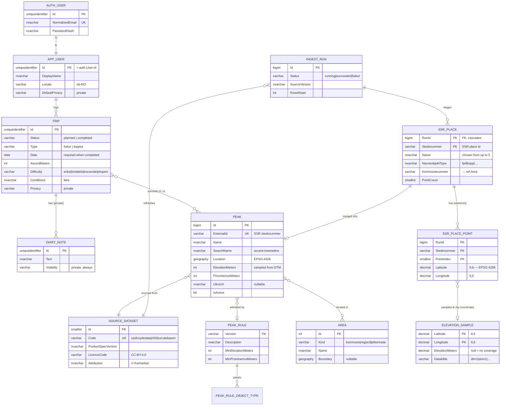

# Data model

The physical model, what it deliberately leaves out, and where each part comes from. The
logical model this implements is
[data architecture §2–3](https://github.com/rekfar/docs/blob/main/architecture/03-data-architecture.md);
the scope is roadmap **Phase 1** plus the reference-data scaffolding the Phase 1 catalogue
seed needs.

## What is modelled

| Table | Purpose | Traces to |
| --- | --- | --- |
| `auth.User` | Credentials, Identity-compatible | FR-ACC-1/2/6, ADR-0010 T9 |
| `app.User` | Profile: display name, locale, default privacy | FR-ACC-3/4 |
| `app.Trip` | Planned and completed trips — the central entity | FR-LOG-1/3/6, FR-PLAN-1/3 |
| `app.TripPeak` | Which peaks a trip involves; "bagged" is derived from it | FR-LOG-2/8 |
| `app.DiaryNote` | Private diary notes on a trip | FR-BOOK-1/2/5, ADR-0009 |
| `ref.Peak` | The peak catalogue, from SSR + Høydedata | FR-PEAK-1/2, FR-REF-1/5/6/10 |
| `ref.Area`, `ref.PeakArea` | Kommune / region / fjellområde, resolved at ingestion | FR-PEAK-3, FR-STAT-3 |
| `ref.SourceDataset` | Provenance, licence and attribution per dataset | FR-REF-3, NFR-LEGAL-2 |
| `ref.PeakRule`, `ref.PeakRuleObjectType` | The versioned rule defining what counts as a peak | FR-REF-11, ADR-0012 §5.1 |
| `ingest.Run` | Refresh history per dataset | FR-REF-3/4 |
| `ingest.SsrPlace`, `ingest.SsrPlacePoint` | The parsed SSR extract, per run, before the peak rule is applied | FR-REF-1/11 |
| `ingest.ElevationSample` | Cached DTM heights, keyed by coordinate | FR-REF-10 |

## Decisions worth knowing

**A planned trip and a completed trip are one table.** Status carries the difference, so
converting a plan into a log (FR-PLAN-3) is an update, not a copy between tables. `Date` is
the target date while planned and the actual date once completed; a check constraint
requires it in the completed state only.

**"Bagged" is derived, not stored.** A peak is bagged if the user has a completed trip
linked to it. Storing a flag would put per-user state inside reference data that gets
rebuilt by re-import — the flag would survive as the one thing in `ref` that cannot be
regenerated.

**Elevation is derived and carries its provenance.** SSR has no height, so elevation is
sampled from Kartverket's DTM and travels with the dataset and date it was sampled from
(FR-REF-10). A constraint refuses an elevation without them, because "2469 m" and "2469 m
sampled from this DTM on this date" are different claims and only the second one can be
checked later.

**Reference rows are retired, never deleted.** How upstream deletions are detected is still
open (ADR-0012 §5.3). Whatever the answer, a peak somebody has logged has to survive it, so
`ref.Peak` has `IsActive`/`RetiredAt` and the foreign key from `app.TripPeak` does not
cascade.

**Auth and profile share a primary key.** `app.User.Id` *is* `auth.User.Id`. One identifier
for a person across authentication and domain data, no join key to keep in step, and no way
for the two to disagree about who exists.

**Peak-to-area membership is precomputed.** Resolved once at ingestion into `ref.PeakArea`
rather than by polygon containment at query time, so filtering by area is an index seek
(NFR-PERF-2). It needs no spatial join at all: every SSR place carries its `kommunenummer`
as an attribute, so the membership is copied rather than derived.

**The peak rule is data, and version 1.0 is seeded.** `fjell` or `topp`, inside mainland
Norway, highest sampled point at 100 m or more — 28,876 of the extract's 1,058,852 places.
The type filter is the editorial judgement; the floor only removes sea-level artefacts. The
reasoning, the measurements it was chosen against, and how to supersede it are in
[peak-rule.md](peak-rule.md). Every peak carries the version that admitted it, and a
published version is never edited: a change is a new version and a re-merge.

**Staging exists so the rule can be decided with the data in front of you.** The published
extract is a 2.6 GB GML file and SSR carries no heights, so parsing it and sampling the
terrain model is the expensive half of ingestion. `ingest.SsrPlace` and
`ingest.SsrPlacePoint` hold the result of that half, per run; applying the peak rule and
merging into `ref.Peak` is then a local set operation that can be re-run whenever the rule
changes. A new rule version is a re-MERGE, not a re-download — which is what makes
FR-REF-11's promise of a reproducible catalogue affordable in practice.

**A snapshot is complete or absent, never half-written.** Staging is keyed by run rather
than replaced in place, so a failed run cannot overwrite the previous extract, and two runs
can be diffed to see what upstream actually changed. Pruning is a delete of the
`ingest.Run` row, which cascades.

**The elevation cache is keyed by coordinate, not by run.** A point's terrain height does
not depend on which extract mentioned it, so a re-run, a widened rule, or a later dataset
asking about the same point all hit a row that already exists. "Asked, and there was no
height here" is cached too, as a NULL elevation — otherwise every run re-asks the same
uncovered points and gets the same nothing.

**Staging is not spatial.** It stores `decimal(9, 6)` latitude and longitude, which is
exactly the precision the extract publishes, and the conversion to `geography` happens in
the merge. That keeps the cache key exact — a float would round differently between runs
and miss — and keeps bulk loading free of the `QUOTED_IDENTIFIER` requirement that spatial
constraints impose on every writer. The bounds checks on those columns are set to mainland
Norway rather than the globe on purpose: the source declares `EPSG:4258`, which puts
latitude first, and a transposed pair is individually valid but silently wrong.

## Not modelled yet

Everything below is in the logical model but belongs to a later roadmap phase. Adding a
table before there is a feature writing to it means an unvalidated guess sitting in the
schema for months.

| Entity | Phase | Notes |
| --- | --- | --- |
| `Cabin` (hytte) | 2 | N50 `Turisthytte`; same external-id/provenance pattern as `Peak` |
| `Trail` (turrute), `RouteInfoPoint` | 2 | Turrutebasen; route geometry volume is still unmeasured (ADR-0010 follow-up) |
| `Track` (spor), `Route` (rute) | 2 | GPX import (FR-DATA-1) |
| `Photo` | 2 | Blob reference plus metadata; binaries in object storage |
| `GuestbookEntry` | 2 | Public, per place, moderatable (ADR-0009) |
| `WishlistItem` | 2 | FR-PLAN-4/5 |
| `ConnectedService`, `Activity` | 2 | Strava, then Garmin (ADR-0008) |
| `Friendship`, trip sharing | 3 | FR-SOCIAL, FR-SHARE. Link sharing will be a token table, not a privacy level |

One thing is also deliberately absent from the current model:

- **`ref.Area.Boundary` has no spatial index.** Boundaries are not loaded yet, and an index
  on a column that is entirely `NULL` is maintenance for nothing. It goes in with the data.

## Volumes

Measured by parsing the published extract, not estimated. Place and point counts
are from the 2026-08-14 whole-country extract:

| Table | Expected | Notes |
| --- | --- | --- |
| `ref.Peak` | ~30k rows or fewer | The extract holds 1,058,852 places; 175,026 are in the `høyder` group, of which `fjell` (25,375) and `topp` (4,562) are the staged candidates. The elevation floor in rule 1.0 takes it down from there |
| `ingest.SsrPlace` | 29,926 rows per retained run | The 29,937 candidates less 11 outside mainland Norway — Newtontoppen and ten East Greenland peaks. One snapshot per run; old runs are pruned by deleting their `ingest.Run` row |
| `ingest.SsrPlacePoint` | 57,720 rows per retained run | 14,357 of the candidates carry a MultiPoint of 2–16 positions, so the average is 1.9 points per place |
| `ingest.ElevationSample` | ~58k rows, growing slowly | Keyed by coordinate, never pruned with a run |
| `ref.Area` | ~400 kommuner + curated regions | Boundary geometry dominates the size once loaded |
| `app.Trip` | Hundreds per user | A personal logbook |

Nothing here strains the free tier. The one figure that could change the picture is
Turrutebasen route geometry, which is why measuring it is an open ADR-0010 follow-up and why
`Trail` is not modelled yet.
