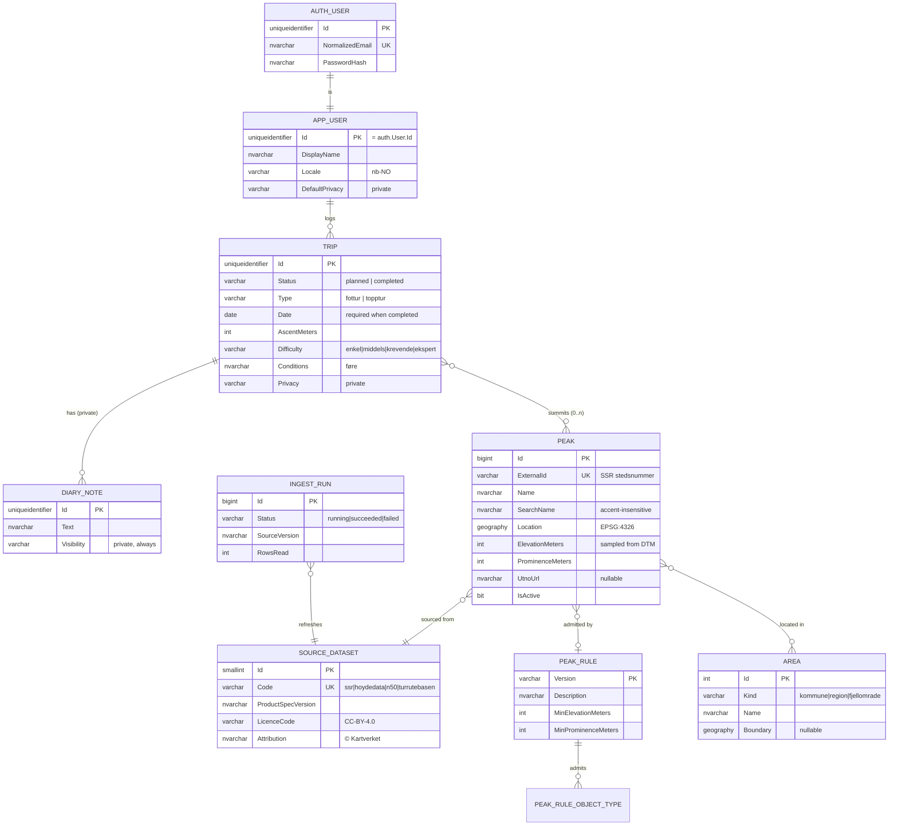

# Data model

The physical model, what it deliberately leaves out, and where each part comes from. The
logical model this implements is
[data architecture §2–3](https://github.com/rekfar/docs/blob/main/architecture/03-data-architecture.md);
the scope is roadmap **Phase 1** plus the reference-data scaffolding the Phase 1 catalogue
seed needs.

## What is modelled

| Table | Purpose | Traces to |
| --- | --- | --- |
| `auth.User` | Credentials, Identity-compatible | FR-ACC-1/2/6, ADR-0010 T9 |
| `app.User` | Profile: display name, locale, default privacy | FR-ACC-3/4 |
| `app.Trip` | Planned and completed trips — the central entity | FR-LOG-1/3/6, FR-PLAN-1/3 |
| `app.TripPeak` | Which peaks a trip involves; "bagged" is derived from it | FR-LOG-2/8 |
| `app.DiaryNote` | Private diary notes on a trip | FR-BOOK-1/2/5, ADR-0009 |
| `ref.Peak` | The peak catalogue, from SSR + Høydedata | FR-PEAK-1/2, FR-REF-1/5/6/10 |
| `ref.Area`, `ref.PeakArea` | Kommune / region / fjellområde, resolved at ingestion | FR-PEAK-3, FR-STAT-3 |
| `ref.SourceDataset` | Provenance, licence and attribution per dataset | FR-REF-3, NFR-LEGAL-2 |
| `ref.PeakRule`, `ref.PeakRuleObjectType` | The versioned rule defining what counts as a peak | FR-REF-11, ADR-0012 §5.1 |
| `ingest.Run` | Refresh history per dataset | FR-REF-3/4 |

## Decisions worth knowing

**A planned trip and a completed trip are one table.** Status carries the difference, so
converting a plan into a log (FR-PLAN-3) is an update, not a copy between tables. `Date` is
the target date while planned and the actual date once completed; a check constraint
requires it in the completed state only.

**"Bagged" is derived, not stored.** A peak is bagged if the user has a completed trip
linked to it. Storing a flag would put per-user state inside reference data that gets
rebuilt by re-import — the flag would survive as the one thing in `ref` that cannot be
regenerated.

**Elevation is derived and carries its provenance.** SSR has no height, so elevation is
sampled from Kartverket's DTM and travels with the dataset and date it was sampled from
(FR-REF-10). A constraint refuses an elevation without them, because "2469 m" and "2469 m
sampled from this DTM on this date" are different claims and only the second one can be
checked later.

**Reference rows are retired, never deleted.** How upstream deletions are detected is still
open (ADR-0012 §5.3). Whatever the answer, a peak somebody has logged has to survive it, so
`ref.Peak` has `IsActive`/`RetiredAt` and the foreign key from `app.TripPeak` does not
cascade.

**Auth and profile share a primary key.** `app.User.Id` *is* `auth.User.Id`. One identifier
for a person across authentication and domain data, no join key to keep in step, and no way
for the two to disagree about who exists.

**Peak-to-area membership is precomputed.** Resolved once at ingestion into `ref.PeakArea`
rather than by polygon containment at query time, so filtering by area is an index seek
(NFR-PERF-2).

**`ref.PeakRule` ships empty.** The rule that decides which SSR points qualify as peaks is
still undecided, and it is a real decision with a documented rationale (FR-REF-11) — not a
default this schema should quietly invent. Seeding it is the first step of the Phase 1
catalogue import, not of the schema.

## Not modelled yet

Everything below is in the logical model but belongs to a later roadmap phase. Adding a
table before there is a feature writing to it means an unvalidated guess sitting in the
schema for months.

| Entity | Phase | Notes |
| --- | --- | --- |
| `Cabin` (hytte) | 2 | N50 `Turisthytte`; same external-id/provenance pattern as `Peak` |
| `Trail` (turrute), `RouteInfoPoint` | 2 | Turrutebasen; route geometry volume is still unmeasured (ADR-0010 follow-up) |
| `Track` (spor), `Route` (rute) | 2 | GPX import (FR-DATA-1) |
| `Photo` | 2 | Blob reference plus metadata; binaries in object storage |
| `GuestbookEntry` | 2 | Public, per place, moderatable (ADR-0009) |
| `WishlistItem` | 2 | FR-PLAN-4/5 |
| `ConnectedService`, `Activity` | 2 | Strava, then Garmin (ADR-0008) |
| `Friendship`, trip sharing | 3 | FR-SOCIAL, FR-SHARE. Link sharing will be a token table, not a privacy level |

Two things are also deliberately absent from the current model:

- **`ref.Area.Boundary` has no spatial index.** Boundaries are not loaded yet, and an index
  on a column that is entirely `NULL` is maintenance for nothing. It goes in with the data.
- **Ingestion staging tables.** `ingest` holds only the run log so far. Staging shapes
  should be designed against a real Kartverket download, not guessed at.

## Volumes

Rough figures, for sizing against the free tier's 32 GB:

| Table | Expected | Notes |
| --- | --- | --- |
| `ref.Peak` | 10k–100k rows | SSR holds ~1M place names; the peak rule selects a fraction of them |
| `ref.Area` | ~400 kommuner + curated regions | Boundary geometry dominates the size once loaded |
| `app.Trip` | Hundreds per user | A personal logbook |

Nothing here strains the free tier. The one figure that could change the picture is
Turrutebasen route geometry, which is why measuring it is an open ADR-0010 follow-up and why
`Trail` is not modelled yet.
